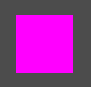

## 一个最简单的 2D Shader
最简单的将一张图片渲染为经典品红色的Shader

```glsl
shader_type canvas_item;

void fragment() {
	COLOR = vec4(1, 0, 1, 1);
}
```


下面可以正确的渲染一张贴图
```glsl
shader_type canvas_item;

void fragment() {
	COLOR = texture(TEXTURE, UV);
}
```
`TEXTURE`为传入的贴图，`UV`就是像素点的位置信息，简单来说就是取`TEXTURE`中对于`UV`位置的颜色。需要注意的是UV是一个标准化坐标，它的原点为**左下角**，值的范围为[0, 1]。


将贴图对应像素点的颜色取出来了，就可以对图片的颜色进行操作了，比如下面的代码可以把一张图片变为灰度图。

```glsl
shader_type canvas_item;

void fragment() {
	vec4 color = texture(TEXTURE, UV);
	float gray = 0.299 * color.r  + 0.587 * color.g + 0.114 * color.b;
	COLOR = vec4(vec3(gray), color.a);
}
```

这个就是根据亮度加权公式(` Y（亮度） = 0.299 * R + 0.587 * G + 0.114 * B`)来计算每个像素的亮度信息，所以展示出来的就是一张只有灰度信息的图片。


以上就是对于贴图最基本的操作了。


